[<< back](../README.md)

# Discrete Fourier Transform in 1D

Let us make a 1D picture of a car:

```R
x<-0:19
y<-c(0,0,0,0,1,1,1.5,2,2,2,2,2,2,2,1.5,1,0.5,0,0,0)
plot(x,y)
lines(x,y)
```
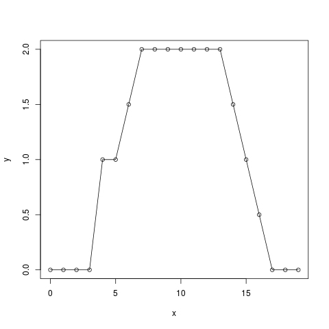

where car wheels are at x = 5 and 15, front window at 5-7 and rear window at 13-17.
This shape can be transformed by Fourier transform as a sum of waves with different
frequencies, amplitudes and phases. It can be shown that this shape can be expressed
as a sum of sine and cosine waves with an infinite wave length (constant function)
and wave lengths equal to the range of data, its 1/2, 1/3, 1/4 etc.

A sine "wave" with infinite wave length `sin(2*pi*0*x/20)` is always zero, so it does
not make sense to scan our car by zero. Let us try with a cosine "wave" of infinite wave length:

```R
plot(x,y, ylim=c(-2,2))
lines(x,y)
lines(x,cos(2*pi*0*x/20), col="red")
points(x,y*cos(2*pi*0*x/20), col="blue")
lines(x,y*cos(2*pi*0*x/20), col="blue")
```
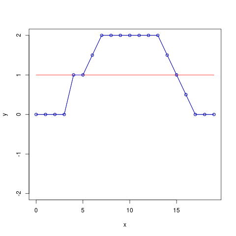

The red line is the infinite-width cosine wave (equal to 1). The blue line is the original
car multiplied by the wave, i.e. the original car. We can sum `y*cos(2*pi*0*x/20))` 
and divide by number of points to evaluate the content of this sine wave in the car image.

```R
sum(y*cos(2*pi*0*x/20))/20
```

Let us try with a sine wave length equal to range of data:

```R
plot(x,y, ylim=c(-2,2))
lines(x,y)
lines(x,sin(2*pi*1*x/20), col="red")
points(x,y*sin(2*pi*1*x/20), col="blue")
lines(x,y*sin(2*pi*1*x/20), col="blue")
sum(y*sin(2*pi*1*x/20))/20
```
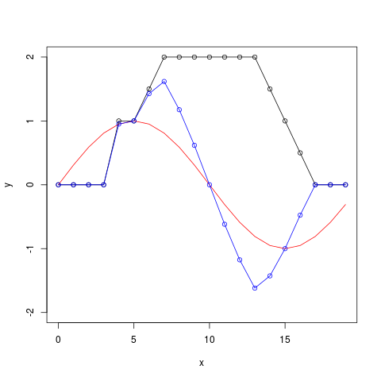

There is not much of this sine wave. Next, let us try with a sine wave length equal
to range 1/2 of data:

```R
plot(x,y, ylim=c(-2,2))
lines(x,y)
lines(x,sin(2*pi*2*x/20), col="red")
points(x,y*sin(2*pi*2*x/20), col="blue")
lines(x,y*sin(2*pi*2*x/20), col="blue")
sum(y*sin(2*pi*2*x/20))/20
```
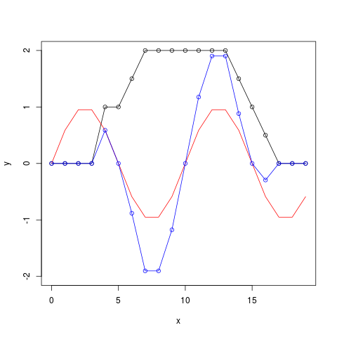

We can try with a sine wave length equal to range 1/3 and 1/4 of data:

```R
plot(x,y, ylim=c(-2,2))
lines(x,y)
lines(x,sin(2*pi*3*x/20), col="red")
points(x,y*sin(2*pi*3*x/20), col="blue")
lines(x,y*sin(2*pi*3*x/20), col="blue")
sum(y*sin(2*pi*3*x/20))/20
```
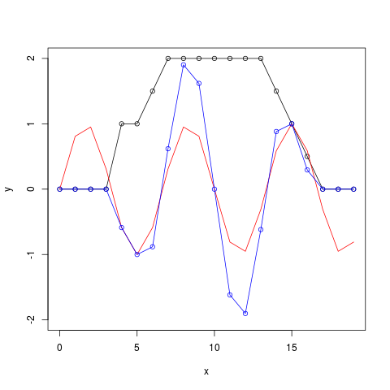


```R
plot(x,y, ylim=c(-2,2))
lines(x,y)
lines(x,sin(2*pi*4*x/20), col="red")
points(x,y*sin(2*pi*4*x/20), col="blue")
lines(x,y*sin(2*pi*4*x/20), col="blue")
sum(y*sin(2*pi*4*x/20))/20
```
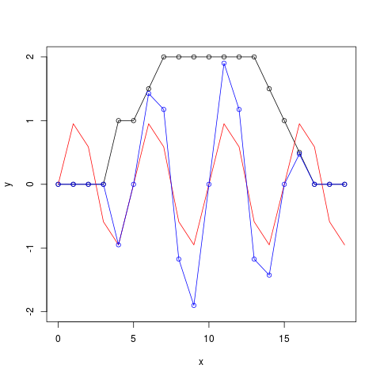

and so forth. If we do this for all sine and cosine waves up 1/19 (1/number of data points - 1),
we can use the corresponding sums divided by numbers of points (wave contents) to perfectly
reconstruct the car image:

```R
f1<-c()
f2<-c()
for(i in 0:19) {
  f1<-c(f1,sum(y*cos(2*pi*i*x/20))/20)
  f2<-c(f2,sum(y*sin(2*pi*i*x/20))/20)
}
```

```R
ynew<-rep(0,20)
for(i in 0:19) {
  ynew<-ynew+f1[i+1]*cos(2*pi*i*x/20)
  ynew<-ynew+f2[i+1]*sin(2*pi*i*x/20)
}
plot(x,ynew)
lines(x,ynew)
```
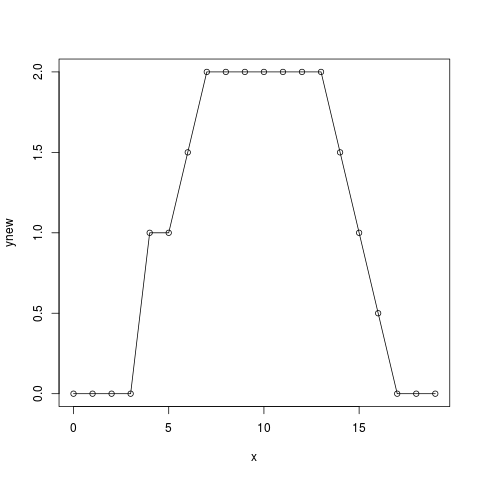

We can plot frequency profiles `f1` and `f2`:

```R
plot(x,f1)
plot(x,f2)
```
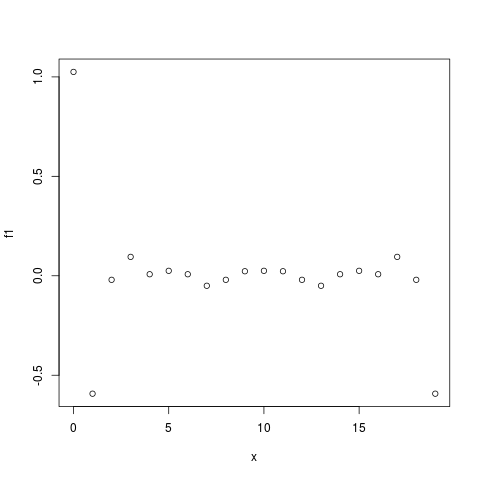
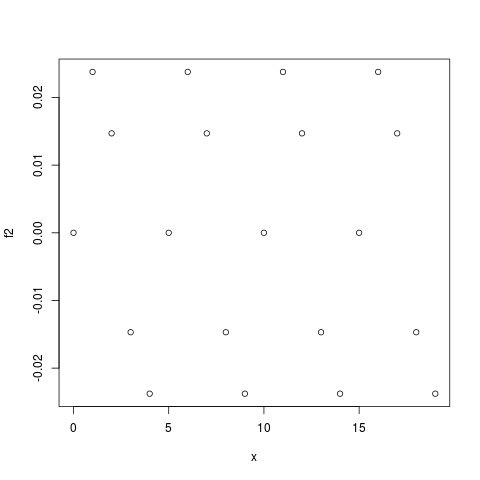

If we use just for example 10 wave pairs instead of all waves we can get almost perfect
car image:

```R
ynew<-rep(0,20)
for(i in 0:9) {
  ynew<-ynew+f1[i+1]*cos(2*pi*i*x/20)
  ynew<-ynew+f2[i+1]*sin(2*pi*i*x/20)
}
plot(x,ynew)
lines(x,ynew)
```
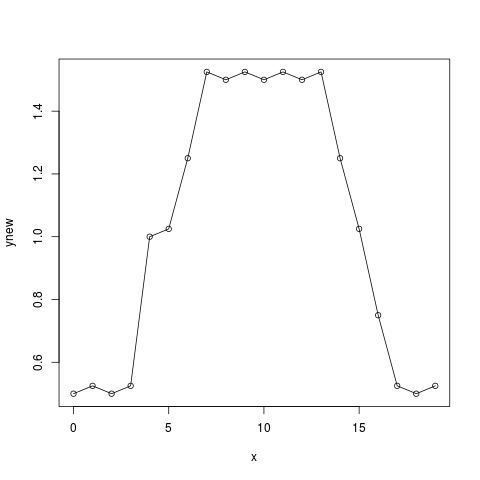

All together, we can express any discrete one-dimensional function with *N* points by (approximately)
*N* pairs of sine and cosine waves of wave lengths equal to infinity, range of function, its 1/2, 1/3,
1/4 up to 1/(*N*-1). The space of functions `f1` and `f2` is called reciprocal space.

Now let us make two images of the car to mimic the situation in the crystal:

```R
x<-0:39
y<-c(0,0,0,0,1,1,1.5,2,2,2,2,2,2,2,1.5,1,0.5,0,0,0)
y<-c(y,y)
plot(x,y)
lines(x,y)
```
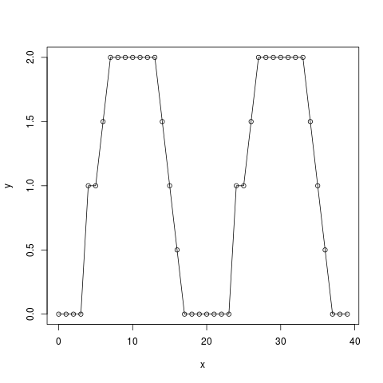

Scanning by a cosine wave of infinite wave length:

```R
plot(x,y, ylim=c(-2,2))
lines(x,y)
lines(x,cos(2*pi*0*x/40), col="red")
points(x,y*cos(2*pi*0*x/40), col="blue")
lines(x,y*cos(2*pi*0*x/40), col="blue")
sum(y*cos(2*pi*0*x/40))/40
```
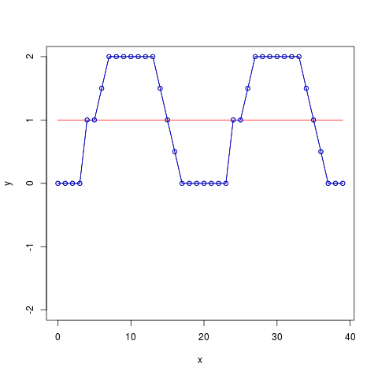

gives the same result as for single image car. The sum is doubled but it is divided by 40 instead of 20.

Scanning by a sine wave of wave length equal to the range gives exactly zero because one car is multiplied
by positive and one by negative part of sine wave:

```R
plot(x,y, ylim=c(-2,2))
lines(x,y)
lines(x,sin(2*pi*1*x/40), col="red")
points(x,y*sin(2*pi*1*x/40), col="blue")
lines(x,y*sin(2*pi*1*x/40), col="blue")
sum(y*sin(2*pi*1*x/40))/40
```
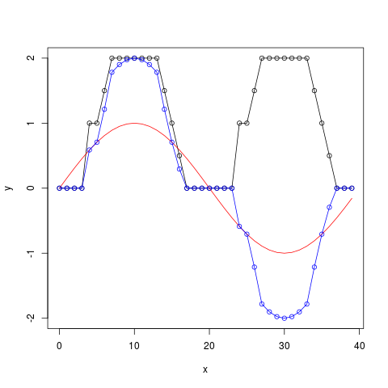

Scanning by a sine wave of wave length equal to 1/2 of the range gives the same result as scanning of a
single car image by a sine wave of wave length equal to its range:

```R
plot(x,y, ylim=c(-2,2))
lines(x,y)
lines(x,sin(2*pi*2*x/40), col="red")
points(x,y*sin(2*pi*2*x/40), col="blue")
lines(x,y*sin(2*pi*2*x/40), col="blue")
sum(y*sin(2*pi*2*x/40))/40
```
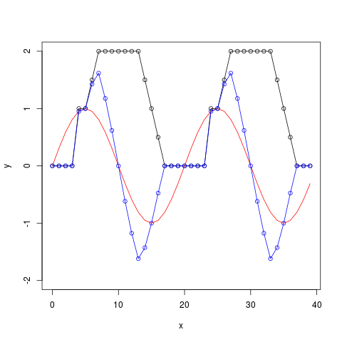

Again, the sum is doubled but divided by 40 instead of 20, similarly to the cosine wave of infinite
wave length. The same situation is with all other frequencies, even frequencies are equal to same values
as for single car image, whereas even frequencies are equal to zero.

```R
f1<-c()
f2<-c()
for(i in 0:39) {
  f1<-c(f1,sum(y*cos(2*pi*i*x/40))/40)
  f2<-c(f2,sum(y*sin(2*pi*i*x/40))/40)
}
plot(x,f1)
plot(x,f2)
```
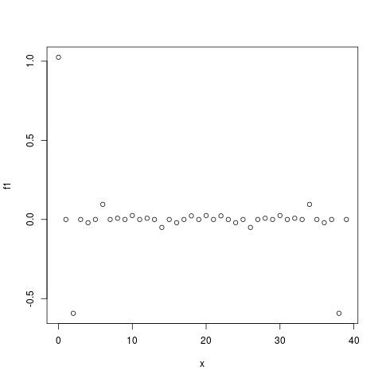
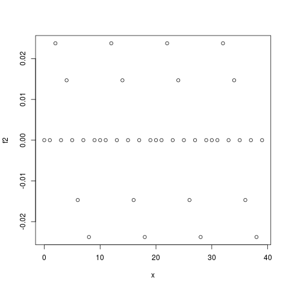

When we replace two cars by four, we obtain a spectrum with all points equal to zero except points
0, 4, 8 etc. equal to spectra of a single car. Similarly, any series of *M* car images will lead to
zero values everywhere, except at 0, *M*, 2*M* etc. In general, points at 0, *M*, 2*M* etc. determine
the shape of the car, whereas points in between determine differences between individual cars.
Similar effect takes place in crystals.

