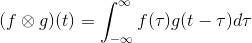

[<< back](../README.md)

# Convolution

Another important point related to Fourier transform is convolution. Convolution takes
two mathematical functions as an input and returns a mathematical function as the output.
Mathematically it is:



You can imagine convolution as taking of function *f* and *g* and moving the function
*g* horizontally by *t* (*g*(*x*-*t*) is *g*(*x*) moved horizontally by value of *t*) and 
plotting integral for each value of *t*. Let us try with a pair of pulse functions:

```R
tau<-0:100/10
f<-rep(0, times=101)
g<-rep(0, times=101)
f[10:19]<-1
g[30:39]<-1
conv<-c()
for(t in 1:80) {
  conv<-c(conv,0.1*sum(f[1:(102-t)]*g[t:101]))
}
plot(tau, f, type="l", col="red")
lines(tau, g, col="blue")
lines(tau[1:80], conv)
```

The convolution of *f* (red) and *g* (blue) step function is a single zigzag function.

The reason why convolution is important in Fourier transform is that Fourier transform
of product of two functions is equal to convolution of Fourier transforms of individual
functions. This is known as a convolution theorem. For example in NMR the signal is
formed by waves with exponential decay.
The signal is most intensive right after excitation and it decays with time because
nuclei are returning back to equilibria. The signal is thus a product of a sine wave
and exponential. Fourier transform of such function is therefore a convolution of
Fourier transforms of these functions. Fourier transform of sine waves gives a delta
function -- infinitely high and infinitely narrow peak with area equal to 1 and 
centered in the frequency of the sine wave. Fourier transform of exponential gives
a Lorenzian function. It is a bell-shaped function similar to Gaussian functions.
Convolution gives and exactly same Lorenzian fuction, but instead of zero it is centered
in the value of frequency of the sine wave. This is the reason why NMR peaks are
bell-shaped functions centered in the frequency.

Another application of convolution theorem is in crystallography. We have already shown
in 1D and 2D that a Fourier transform of a periodic function is the same as a Fourier
transform of a single unit except that it is separated by several zero bins. We have
explained it practically using appropriate plots. It is possible to explain this using
convolution theorem. A periodically repeating function (or a crystal) can be seen as
a convolution of a series of delta functions (infinitely narrow peaks) centered in
centers of the unit cell and a single unit of the periodic function (single cell).
The Fourier transform is thus a product of the Fourier transform of the series of delta
functions and the Fourier transform of the single cell. This gives the Fourier transform
of the single image separated by series of zero bins.

Convolution and deconvolution can be used in other areas. Artificial neuronal networks
are used in a wide range of applications. For example it can read hand-written zip
codes on envelopes. Since zip codes are written in pre-printed boxes, it is possible
to use usual neural network. But if zip codes are not written in pre-printed boxes
or a neural network should for example recognize traffic signs in order to drive
an autonomous cars it is necessary to recognize object anywhere in a large visual
field. Thanks to convolution, convolutional neuronal networks do this job. In microscopy
it is possible to look at the image as a convolution of true image with an error.
Deconvolution can be than used to eliminate the error.

