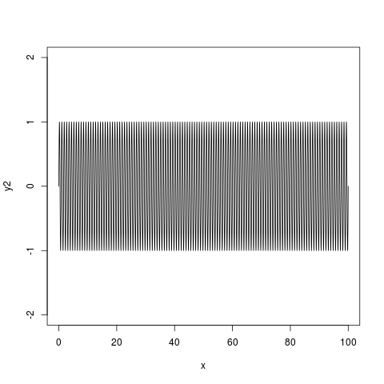
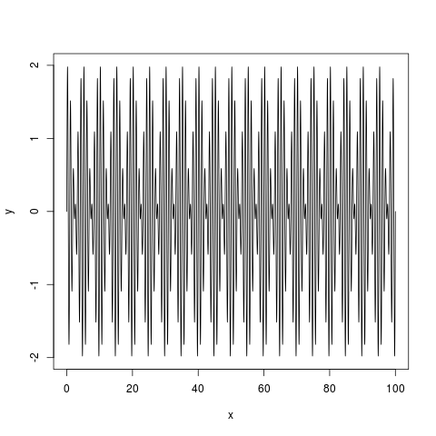
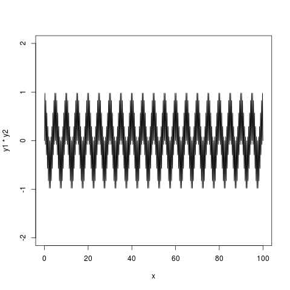
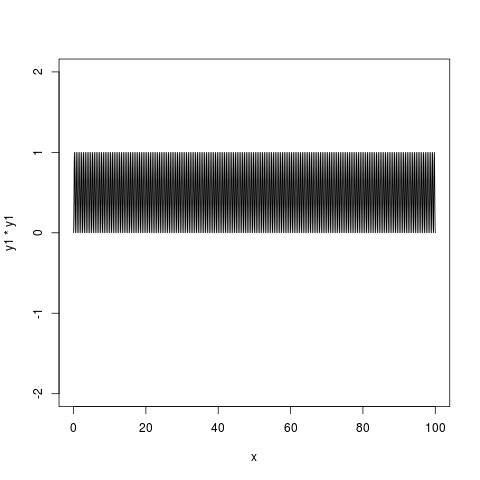
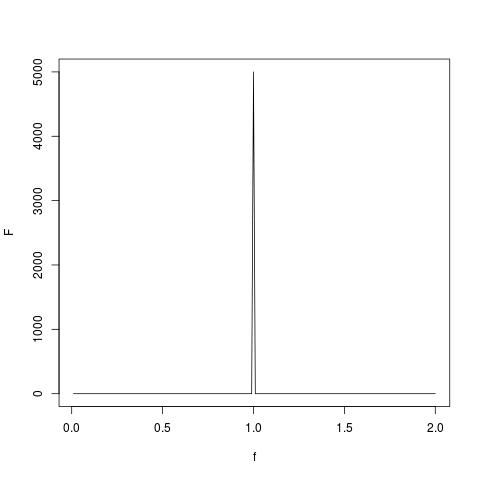
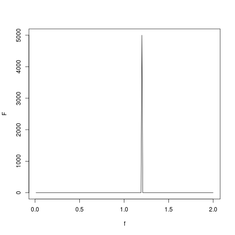
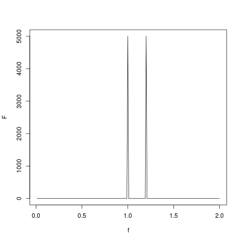
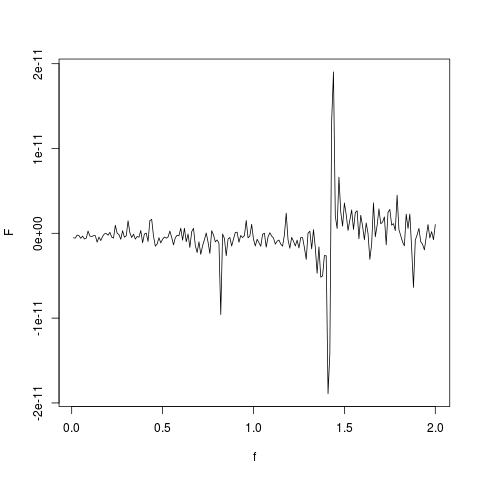
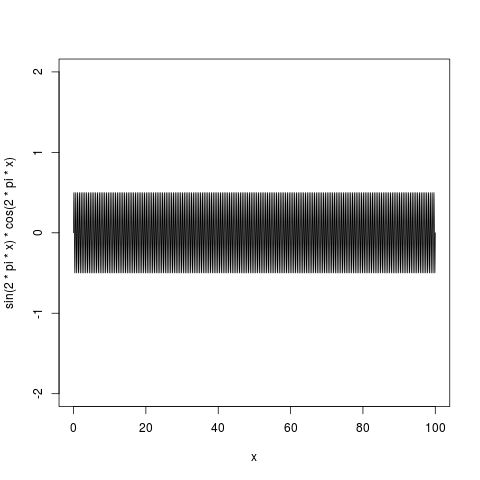
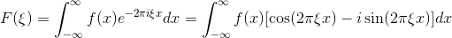

# Continuous Fourier Transform in 1D

Let's have a simple sine wave for `x` from 0 to 10:

```R
x<-0:10000/100
y1<-sin(2*pi*x)
plot(x, y1, ylim=c(-2,2), type="l")
```


This sine wave (it could be for example a sound wave, i.e. pure tone) has frequency equal to 1. It is possible to make another sine wave of frequency 1.2 (it could be another tone):

```R
y2<-sin(2*pi*1.2*x)
plot(x, y2, ylim=c(-2,2), type="l")
```


It is possible to sum both sine waves (analogous to pressing two keys corresponding to these tones on a keyboard) and plot them:

```R
y<-y1+y2
plot(x, y, ylim=c(-2,2), type="l")
```


Now let's try to decompose this mixture of tones. In real life you can do it by a spectral analyser at your HiFi set or on your MP3 player software. HiFi set or MP3 player software often contains a spectral analyser which plots a content of low and high frequency sounds in your music. In order to do this in R we will look at a product of two sine wave, for example `y1` and `y2`:

```R
plot(x, y1*y2, ylim=c(-2,2), type="l")
```


You can see that the product is a periodic function (not simply a sine wave). Most interestingly, the function contains repeating parts, where one part is a kid of mirror image of another part. If you sum values of `y1*y2`:

```R
sum(y1*y2)
```

You get reasonably low number. You can try with different frequencies and you should observe a similar trend. The only exception is when both frequencies become close to each other or the same:

```R
plot(x, y1*y1, ylim=c(-2,2), type="l")
sum(y1*y1)
```


This is because a product of two sine waves with same frequency is always positive. A product of two sine waves of different frequencies alternates between negative and positive parts and these parts cancel out each other in the sum.

You can try to make an vector of frequencies `f` and empty vector `F` and to fill `F` by `sum(y1*sin(2*pi*f*x))`:

```R
f<-1:200/100
F<-c()
for(ff in f) {
  F<-c(F,sum(y1*sin(2*pi*ff*x)))
}
plot(f,F, type="l")
```


You should get a peak at `f` = 1. In the other words we scanned our signal `y` by different frequencies and we found that the mostly present one is 1. You can try for `y2`:

```R
f<-1:200/100
F<-c()
for(ff in f) {
  F<-c(F,sum(y2*sin(2*pi*ff*x)))
}
plot(f,F, type="l")
```


You get a peak at `f` 1.2. Finally try with `y`:

```R
f<-1:200/100
F<-c()
for(ff in f) {
  F<-c(F,sum(y*sin(2*pi*ff*x)))
}
plot(f,F, type="l")
```


You get two peaks at 1 and 1.2. The height of a peak gives you a content of a sine wave of frequency `f` in waves `y1`, `y2` and `y`. When the frequency in e.g. `y` is close to some `f`, the product of sine waves becomes always positive and its sum becomes high. When the frequency `f` is absent in `y`, the product of sine waves alternates between positive and negative, which cancel each other, and its sum becomes low. 

What about when we replace sin by cos:

```R
f<-1:200/100
F<-c()
for(ff in f) {
  F<-c(F,sum(y*cos(2*pi*ff*x)))
}
plot(f,F, type="l")
```


The reuslt is just a noise. This is because the product of sine and cosine of the same frequency is again a function alternating between negative and positive values and its sum is zero:

```R
plot(x, sin(2*pi*x)*cos(2*pi*x), ylim=c(-2,2), type="l")
sum(sin(2*pi*x)*cos(2*pi*x))
```


In the other words, there is a high content of sine but no cosine function. In the other other words, phase matters. Separate scanning by sine and cosine gives you the information on content of waves of certain frequncies and their phases.

Mathematically speaking:



The tested function *f*(*x*) is multiplied ("scanned") by either cos(2&pi;&xi;*x*) (the real part of *F*) or
by -sin(2&pi;&xi;*x*) (imaginary part of *F*). In examples above we used sum instead of integral
(you can replace sum by sum divided by a bin size, which corresponds to numerical integration).
The resulting pair of spectra gives an information about content of certain frequency and its phase.

