[<< back](../README.md)

# Discrete Fouriere transform in 2D

Before we start with Fourier transform let me introduce the R function `outer`. This function takes two
vectors and a function as arguments and creates a matrix. Let us ilustrate on this example:

```R
x<-1:3
y<-2:4
w<-outer(x, y, "*")
w
```
The function `outer` returns `y` multiplied by `x[1]` as the first row, `y` multiplied by `x[2]` as the
second row etc. Or, it returns `x` multiplied by `y[1]` as the first column, `x` multiplied by `y[2]` as
the second column etc.

It can be used to generate 2D waves:
```R
x<-0:99
y<-0:99
w<-cos(outer(2*pi*x/100,2*pi*y/100,"+"))
persp(w,  phi = 50, theta = -50, xlab="x", ylab="y", zlab="f")
image(w)
```
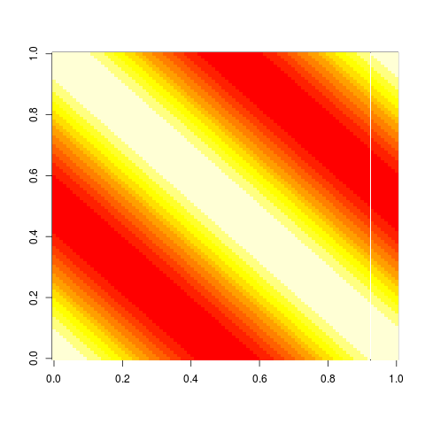

The function `persp` was used to show the function in perspective but we will use the function `image`
instead. We can further add coeficients *h* and *k* into the function `outer`:
```R
x<-0:99
y<-0:99
h<-2
k<-3
w<-cos(outer(2*pi*h*x/100, 2*pi*k*y/100, "+"))
image(w)
```
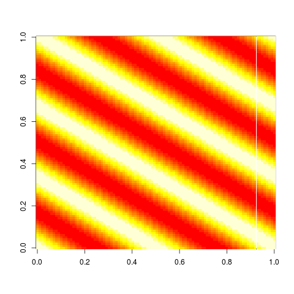

The *h*=2 and *k*=3 cause that if you look at the bottom or top or enywhere in the plot there are
two cosine waves (4 pi) in the horizontal and if you look at the bottom or top or enywhere in the
plot there are three cosine waves (6 pi).

Similarly to 1D examples, you can do the same with the sine wave and with waves of *k* and *h*
equal to zero or negative.
```R
x<-0:99
y<-0:99
h<-0
k<-3
w<-sin(outer(2*pi*h*x/100, 2*pi*k*y/100, "+"))
image(w)
```
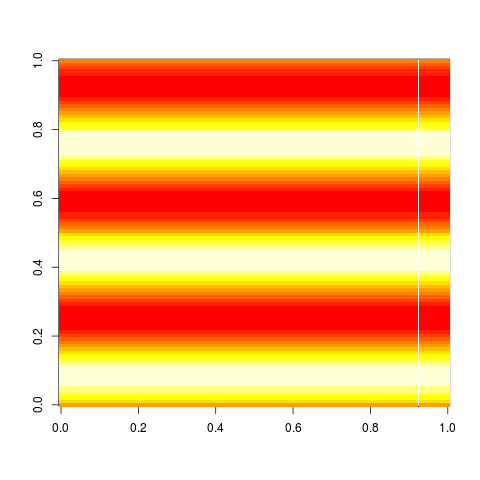

In the 1D example we used a 1D car drawn on 20 points and we have shown that we can detrermine it
by amplitudes 20 sines and 20 cosine waves (or 20 cosine waves with corresponding phases). In 2D
example we will make a 2D image of car drawn on 20x20 point canvas:
```R
z<-matrix(rep(0,times=400), nrow=20)
z[3:17,5:8]<-2
z[6:16,9:12]<-1
z[4:5,4:5]<-1
z[15:16,4:5]<-1
image(z)
```
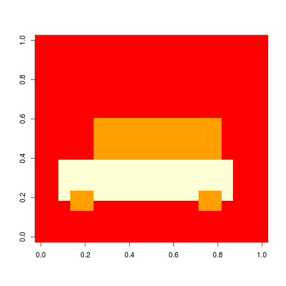

Similarly to 1D case we have a limited number of waves to determine the car image. These are 2D
sine and cosine waves with coefficients *h* from 0 to 19 and *k* from 0 to 19. We can look at
the content of the cosine wave with *h*=2 and *k*=3:
```R
x<-0:19
y<-0:19
h<-2
k<-3
w<-cos(outer(2*pi*h*x/20, 2*pi*k*y/20, "+"))
image(w)
image(w*z)
sum(w*z)/20
```
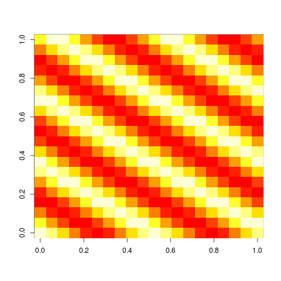
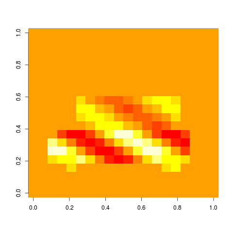

Now, let us try with cosine and sine waves with all *h* and *k* values:
```R
f1<-matrix(rep(0, times=20*20), nrow=20)
f2<-matrix(rep(0, times=20*20), nrow=20)
x<-0:19
y<-0:19
for(h in 0:19) {
  for(k in 0:19) {
    w<-cos(outer(2*pi*h*x/20, 2*pi*k*y/20, "+"))
    f1[h+1,k+1]<-sum(w*z)/400
    w<-sin(outer(2*pi*h*x/20, 2*pi*k*y/20, "+"))
    f2[h+1,k+1]<-sum(w*z)/400
  }
}
image(f1)
image(f2)
```
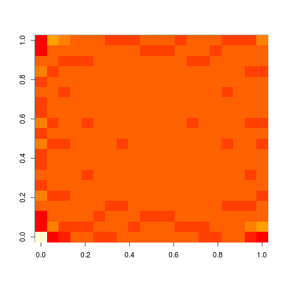
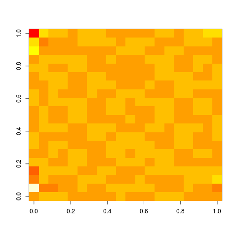

We made a "2D spectra" of the car image. Again reconstruct the car image from *h* and *k* waves:
```R
znew<-matrix(rep(0,times=400), nrow=20)
for(h in 0:19) {
  for(k in 0:19) {
    w<-cos(outer(2*pi*h*x/20, 2*pi*k*y/20, "+"))
    znew<-znew+f1[h+1,k+1]*w
    w<-sin(outer(2*pi*h*x/20, 2*pi*k*y/20, "+"))
    znew<-znew+f2[h+1,k+1]*w
  }
}
image(znew)
```


Again, when we make several copies of car in the crystal manner we obtain the same spectra but
with blank spaces:
```R
z<-matrix(rep(0,times=400), nrow=20)
z[3:17,5:8]<-2
z[6:16,9:12]<-1
z[4:5,4:5]<-1
z[15:16,4:5]<-1
image(z)
```


```R
z2<-matrix(rep(0,times=9*400), nrow=3*20)
z2[1:20,1:20]<-z
z2[1:20,21:40]<-z
z2[1:20,41:60]<-z
z2[21:40,1:20]<-z
z2[21:40,21:40]<-z
z2[21:40,41:60]<-z
z2[41:60,1:20]<-z
z2[41:60,21:40]<-z
z2[41:60,41:60]<-z
image(z2)
```

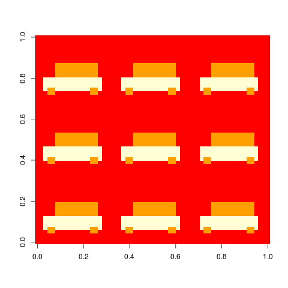

```R
f1<-matrix(rep(0, times=60*60), nrow=60)
f2<-matrix(rep(0, times=60*60), nrow=60)
x<-0:59
y<-0:59
for(h in 0:59) {
  for(k in 0:59) {
    w<-cos(outer(2*pi*h*x/60, 2*pi*k*y/60, "+"))
    f1[h+1,k+1]<-sum(w*z2)/3600
    w<-sin(outer(2*pi*h*x/60, 2*pi*k*y/60, "+"))
    f2[h+1,k+1]<-sum(w*z2)/3600
  }
}
image(f1)
image(f2)
```
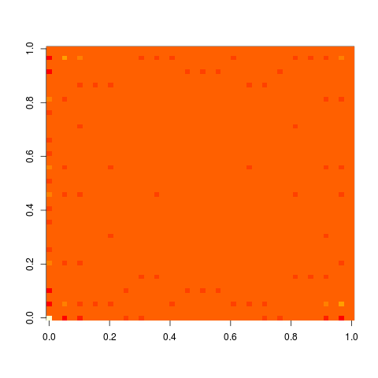
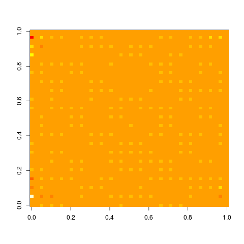

Similarly to 1D example, places of "spots" (points with non-zero values) determine the shape of lattice on
which the car is periodically located. Phase (i.e. how much sine and how much cosine wave is present) is not
important for determination of the shape of the lattice. Intensities of "spots" and phases determine
the shape of the car. Finally, intensities in points other than spots determine differences between individual
cars (no intensities means that all cars are same).


