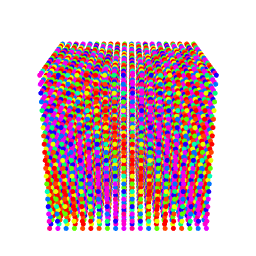

[<< back](../README.md)

# Discrete Fouriere transform in 3D

Discreete Fourier transform can be easilly generalized from 2D to 3D. Fist we make a 3D car:
```R
d<-array(0, dim=c(20,20,20))
d[3:17,5:8,5:15]<-2
d[6:16,9:12,5:15]<-1
d[4:5,4:5,5:6]<-1
d[15:16,4:5,5:6]<-1
d[4:5,4:5,14:15]<-1
d[15:16,4:5,14:15]<-1
library(reshape2)
library(rgl)
dm<-melt(d)
points3d(dm$Var1,dm$Var2,dm$Var3,size=5,color=rainbow(3)[dm$value+1])
```


If you get error message you have to install package reshape2 and rgl by `install.packages("reshape2")`
and `install.packages("rgl")`.

Instead of waves with coeficients *h* and *k* we have three coeficients *h*, *k* and *l*:
```R
x<-0:19
y<-0:19
z<-0:19
h<-2
k<-3
l<-1
w<-outer(2*pi*k*y/20, 2*pi*l*z/20, "+")
w<-cos(outer(2*pi*h*x/20, w, "+"))
library(reshape2)
library(rgl)
wm<-melt(w)
points3d(wm$Var1,wm$Var2,wm$Var3,size=5,color=rainbow(22)[10*(wm$value+1)+1])
```


Now, let us try to scan the 3D car with cosine and sine waves with all *h*, *k* and *l* values
(**may be slow, be patient or stop with Ctrl+C**):
```R
f1<-array(0, dim=c(20,20,20))
f2<-array(0, dim=c(20,20,20))
x<-0:19
y<-0:19
z<-0:19
for(h in 0:19) {
  for(k in 0:19) {
    for(l in 0:19) {
      w<-outer(2*pi*k*y/20, 2*pi*l*z/20, "+")
      w<-cos(outer(2*pi*h*x/20, w, "+"))
      f1[h+1,k+1,l+1]<-sum(w*d)/8000
      w<-outer(2*pi*k*y/20, 2*pi*l*z/20, "+")
      w<-sin(outer(2*pi*h*x/20, w, "+"))
      f2[h+1,k+1,l+1]<-sum(w*d)/8000
    }
  }
}
library(reshape2)
library(rgl)
f1m<-melt(f1)
points3d(f1m$Var1,f1m$Var2,f1m$Var3,size=5,color=rainbow(100)[99*(f1m$value-min(f1m$value))/(max(f1m$value)-min(f1m$value))+1])
f2m<-melt(f2)
points3d(f2m$Var1,f2m$Var2,f2m$Var3,size=5,color=rainbow(100)[99*(f2m$value-min(f2m$value))/(max(f2m$value)-min(f2m$value))+1])
```


We made a "3D spectra" of the car. Again reconstruct the car image from *h*, *k* and *l* waves:
```R
dnew<-array(0, dim=c(20,20,20))
for(h in 0:19) {
  for(k in 0:19) {
    for(l in 0:19) {
      w<-outer(2*pi*k*y/20, 2*pi*l*z/20, "+")
      w<-cos(outer(2*pi*h*x/20, w, "+"))
      dnew<-dnew+f1[h+1,k+1,l+1]*w
      w<-outer(2*pi*k*y/20, 2*pi*l*z/20, "+")
      w<-sin(outer(2*pi*h*x/20, w, "+"))
      dnew<-dnew+f2[h+1,k+1,l+1]*w
    }
  }
}
library(reshape2)
library(rgl)
dmnew<-melt(dnew)
points3d(dmnew$Var1,dmnew$Var2,dmnew$Var3,size=5,color=rainbow(3)[dmnew$value+1.00000001])
```


There are some numerical errors caused by rounding up, therefore we added 1.00000001 instead of
just 1 for plot color. Again, when we make several copies of car in the crystal manner we obtain
the same spectra but with blank spaces, but this you can do it without my help or you must believe
me.


