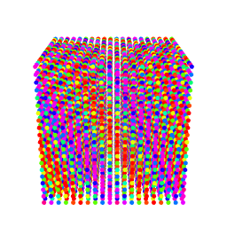

# Applications

## NMR

Fourier transform can be applied in many fields of chemistry and life sciences.
In NMR and IR it is used to obtain spectra from the signal. The phase problem
in NMR is solved by phasing. Before the phasing the spectrum may contain correct
symmetric peaks in phase, negative (antiphase) peaks and asymmetric peaks with
part of peak positive and part of peak negative. It is possible to manually or
mathematically tune the spectra in a way to obtain a nice spectrum with all
positive and symmetric peaks. We can show it in R. We will take a free induction
decay (FID) of with frequency 60.25. The term `exp(-0.001*t)` models the decay.

```R
t<-0:999
fid<-cos(2*pi*60.25*t/1000)*exp(-0.001*t)
plot(t, fid, type="l")
```

```R
f1<-c()
f2<-c()
for(i in 0:100) {
  f1<-c(f1, sum(fid*cos(2*pi*i*t/1000))/1000)
  f2<-c(f2, sum(fid*sin(2*pi*i*t/1000))/1000)
}
plot(0:100, f1, type="l")
plot(0:100, f2, type="l")
```



Because we sample the signal by integral vales of frequency and 60.25 is
non-integral we obtain spectra out of phase, both if scanned by sine (`f1`)
or cosine (`f2`) wave.

```R
plot(0:100, sqrt(f1*f1+f2*f2), type="l")
```


We can solve this by summation of squares of `f1` and `f2` in so called
power spectra. Or we can phase our spectra by choosing an angle &omega;
and calculating `sin(omega)*f1+cos(omega)*f2`. Setting &omega; to 0.1 does
not lead to properly phased spectrum.

```R
omega<-0.1*2*pi
plot(0:100, sin(omega)*f1+cos(omega)*f2, type="l")
```


But &omega; equal to 0.2 gives good spectrum.

```R
omega<-0.2*2*pi
plot(0:100, sin(omega)*f1+cos(omega)*f2, type="l")
```


Before NMR experiment it is possible to do the same job by hardware or software
operations. Advantage of phasing compared to power spectra is in the fact that
peaks in phased spectra are more narrow than peaks in power spectra.

## Microscopy

2D Fourier transform can be used in microscopy. Some objects such as viral
coats, fibers or crystals are naturally periodic. Fourier transforms of
a periodic image gives a series of peaks on a noisy background. As already
shown, peak positions determine the periodicity of the image, intensities
in peak positions determine the structure of a single cell and intensities
outside peaks determine the differences between the cells. It is possible
to use Fourier transform to convert the image to the space of frequencies,
wipe out (set to zero) and to convert the signal back to the original space.
This will suppress differences between units and it will enhance
the periodicity.

Similarly, it is possible to remove unwanted periodic patterns
caused for example by image acquisition (grid of CCD chip) from an image.
It is possible to transform the image to the space of frequencies, wipe out
the peaks corresponding to unwanted periodic patterns and convert image back
to the original space. We can illustrate it on the example of our car image
with added periodic noise. This noise can mimic presence of grid artifacts
caused by image acquisition.

```R
z<-matrix(rep(0,times=400), nrow=20)
z[3:17,5:8]<-2
z[6:16,9:12]<-1
z[4:5,4:5]<-1
z[15:16,4:5]<-1
znoise<-z
for(i in 1:5) {
  znoise[4*i,1:5*4]<-z[4*i,1:5*4]+rep(1, times=5)
}
image(znoise)
```


We can do Fourier transform:
```R
f1<-matrix(rep(0, times=20*20), nrow=20)
f2<-matrix(rep(0, times=20*20), nrow=20)
x<-0:19
y<-0:19
for(h in 0:19) {
  for(k in 0:19) {
    w<-cos(outer(2*pi*h*x/20, 2*pi*k*y/20, "+"))
    f1[h+1,k+1]<-sum(w*znoise)/400
    w<-sin(outer(2*pi*h*x/20, 2*pi*k*y/20, "+"))
    f2[h+1,k+1]<-sum(w*znoise)/400
  }
}
image(f1)
image(f2)
```


In the spectra you can see peaks indicating the presence of periodic structure. In particular,
there are peaks at points [6,6], [11,1], [1,11] etc. in `f1` and [1,6], [6,1], [11,6], [6,11]
etc. in `f2`. We can wipe out periodicity by setting values in these points to zero.

```R
f1[6,6]<-0
f1[11,1]<-0
f1[1,11]<-0
f1[11,11]<-0
f2[1,6]<-0
f2[6,1]<-0
f2[6,11]<-0
f2[11,6]<-0
znew<-matrix(rep(0,times=400), nrow=20)
for(h in 0:19) {
  for(k in 0:19) {
    w<-cos(outer(2*pi*h*x/20, 2*pi*k*y/20, "+"))
    znew<-znew+f1[h+1,k+1]*w
    w<-sin(outer(2*pi*h*x/20, 2*pi*k*y/20, "+"))
    znew<-znew+f2[h+1,k+1]*w
  }
}
image(znew)
```


Filtering is not perfect, but you can try yourself to show that the image `znew` is closer to
`z` than to `znoise`.

You can try [more practical example](https://imagej.nih.gov/ij/docs/examples/FFT/index.html)
using [ImageJ](https://imagej.nih.gov/ij/index.html) program.

## Crystallography

3D Fourier transform is the key method for data analysis in X-ray crystallography and many other
diffraction methods. In protein crystallography the crystal of protein is irradiated by X-ray
beam. Electron density of protein(s) in each cell are sensed by X-rays. The process of diffraction
represents the process of Fourier transform. X-rays are diffracted to various angles and detected
as spots on photographic board or CCD chip. The geometry of crystal, i.e. the shape and size of
each cell, determines positions of spots. The shape (electron density) in each cell determines
the intensity of spots. This is similar to periodic car images in 1D and 2D. A software can 
automatically identify positions of all spots. From this it is possible to calculate the shape of the
crystal cell. Next, it is possible to measure intensities of all spots. These intensities are
determined by electron density of the protein in the single cell. In order to obtain electron
densities from spot intensities we would need intensities of cosine and sine waves, i.e. the phases.
Unfortunately, the photographic material or CCD chips cannot recognize the phase. We can determine
overall intensity (similarly to power spectra). Therefore we cannot determine the structure directly.
This phenomenon is called phase problem. The phase problem can be solved by several methods.
The most common is molecular replacement. For this we need an approximate electron densities
obtained usually from structures of similar proteins. It is possible to place such model into the
crystal lattice and predict diffraction intensities by Fourier transform. If this structure is
sufficiently similar to the studied protein and if it is correctly placed in the crystal the
predicted diffraction would be in good agreement with the measured diffractions. The model can
be further optimized to reach satisfactory agreement between predicted and measured diffractions.


