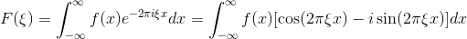
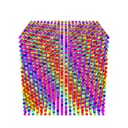
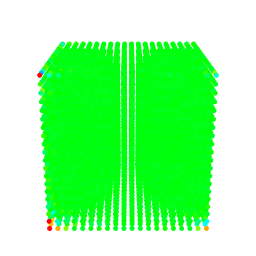
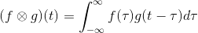

# Basic R

You can use R just like a calculator:
```{r}
1+1
```
Numbers and results of arithmetic operations can be stored in variables using `<-` symbol:

```{r}
x<-1
x
y<-1+1
y
```

Vectors can be created by `c()` function:

```{r}
x<-c(1,3,2,3,4,5)
x
```

This function can be also used to add an element to a vector or to join two vectors:

```{r}
x<-c(1,3,2,3,4,5)
x
x<-c(x,6)
x
x<-c(x,x)
x
```

It is possible to add, subtract, multiply or divide a vector by constant:

```{r}
x<-c(1,3,2,3,4,5)
x+1
2*x
```

Two vectors of same lengths can be added, subtracted, multiplied or divided (last two are element-wise operations):

```{r}
x<-c(1,2,3)
y<-c(3,1,1)
x+y
x-y
x*y
```

Functions can be applied as well:

```{r}
x<-c(1,2,3)
sin(x)
```

It is possible to create a simple series vector by `start:end`:

```{r}
x<-1:10
```

Finally, you can use plot function to make a simple plot:

```{r}
x<-0:100/10
y<-sin(x)
plot(x,y) # for points
plot(x,y, type="l") # for lines
```

or it is possible to add lines to existing plot:

```{r}
plot(x,y) # for points, do not close the window of the plot!!!
lines(x,y) # for lines
```

In R you can also do programming like for-cycles:

```{r}
for(i in 1:100) {
  print(i)
}
```

More info can be found at www.r-project.org, here https://github.com/spiwokv/Rtutorial or in many books.

# Continuous Fourier Transform in 1D

Let's have a simple sine wave for `x` from 0 to 10:

```{r}
x<-0:10000/100
y1<-sin(2*pi*x)
plot(x, y1, ylim=c(-2,2), type="l")
```

This sine wave (it could be for example a sound wave, i.e. pure tone) has frequency equal to 1. It is possible to make another sine wave of frequency 1.2 (it could be another tone):

```{r}
y2<-sin(2*pi*1.2*x)
plot(x, y2, ylim=c(-2,2), type="l")
```

It is possible to sum both sine waves (analogous to pressing two keys corresponding to these tones on a keyboard) and plot them:

```{r}
y<-y1+y2
plot(x, y, ylim=c(-2,2), type="l")
```

Now let's try to decompose this mixture of tones. In real life you can do it by a spectral analyzer at your HiFi set or on your MP3 player software. HiFi set or MP3 player software often contains a spectral analyzer which plots a content of low and high frequency sounds in your music. In order to do this in R we will look at a product of two sine wave, for example `y1` and `y2`:

```{r}
plot(x, y1*y2, ylim=c(-2,2), type="l")
```

You can see that the product is a periodic function (not simply a sine wave). Most interestingly, the function contains repeating parts, where one part is a kid of mirror image of another part. If you sum values of `y1*y2`:

```{r}
sum(y1*y2)
```

You get reasonably low number. You can try with different frequencies and you should observe a similar trend. The only exception is when both frequencies become close to each other or the same:

```{r}
plot(x, y1*y1, ylim=c(-2,2), type="l")
sum(y1*y1)
```

This is because a product of two sine waves with same frequency is always positive. A product of two sine waves of different frequencies alternates between negative and positive parts and these parts cancel out each other in the sum.

You can try to make an vector of frequencies `f` and empty vector `F` and to fill `F` by `sum(y1*sin(2*pi*f*x))`:

```{r}
f<-1:200/100
F<-c()
for(ff in f) {
  F<-c(F,sum(y1*sin(2*pi*ff*x)))
}
plot(f,F, type="l")
```

You should get a peak at `f` = 1. In the other words we scanned our signal `y` by different frequencies and we found that the mostly present one is 1. You can try for `y2`:

```{r}
f<-1:200/100
F<-c()
for(ff in f) {
  F<-c(F,sum(y2*sin(2*pi*ff*x)))
}
plot(f,F, type="l")
```

You get a peak at `f` 1.2. Finally try with `y`:

```{r}
f<-1:200/100
F<-c()
for(ff in f) {
  F<-c(F,sum(y*sin(2*pi*ff*x)))
}
plot(f,F, type="l")
```

You get two peaks at 1 and 1.2. The height of a peak gives you a content of a sine wave of frequency `f` in waves `y1`, `y2` and `y`. When the frequency in e.g. `y` is close to some `f`, the product of sine waves becomes always positive and its sum becomes high. When the frequency `f` is absent in `y`, the product of sine waves alternates between positive and negative, which cancel each other, and its sum becomes low. 

What about when we replace sin by cos:

```{r}
f<-1:200/100
F<-c()
for(ff in f) {
  F<-c(F,sum(y*cos(2*pi*ff*x)))
}
plot(f,F, type="l")
```

The reuslt is just a noise. This is because the product of sine and cosine of the same frequency is again a function alternating between negative and positive values and its sum is zero:

```{r}
plot(x, sin(2*pi*x)*cos(2*pi*x), ylim=c(-2,2), type="l")
sum(sin(2*pi*x)*cos(2*pi*x))
```

In the other words, there is a high content of sine but no cosine function. In the other other words, phase matters. Separate scanning by sine and cosine gives you the information on content of waves of certain frequencies and their phases.

Mathematically speaking:

{width=80%}

The tested function *f*(*x*) is multiplied ("scanned") by either $cos(2 \pi \xi \textbf{x})$ (the real part of *F*) or
by $-sin(2 \pi \xi \textbf{x})$ (imaginary part of *F*). In examples above we used sum instead of integral
(you can replace sum by sum divided by a bin size, which corresponds to numerical integration).
The resulting pair of spectra gives an information about content of certain frequency and its phase.

# Discrete Fourier Transform in 1D

Let us make a 1D picture of a car:

```{r}
x<-0:19
y<-c(0,0,0,0,1,1,1.5,2,2,2,2,2,2,2,1.5,1,0.5,0,0,0)
plot(x,y)
lines(x,y)
```

where car wheels are at x = 5 and 15, front window at 5-7 and rear window at 13-17.
This shape can be transformed by Fourier transform as a sum of waves with different
frequencies, amplitudes and phases. It can be shown that this shape can be expressed
as a sum of sine and cosine waves with an infinite wave length (constant function)
and wave lengths equal to the range of data, its 1/2, 1/3, 1/4 etc.

A sine "wave" with infinite wave length `sin(2*pi*0*x/20)` is always zero, so it does
not make sense to scan our car by zero. Let us try with a cosine "wave" of infinite wave length:

```{r}
plot(x,y, ylim=c(-2,2))
lines(x,y)
lines(x,cos(2*pi*0*x/20), col="red")
points(x,y*cos(2*pi*0*x/20), col="blue")
lines(x,y*cos(2*pi*0*x/20), col="blue")
```

The red line is the infinite-width cosine wave (equal to 1). The blue line is the original
car multiplied by the wave, i.e. the original car. We can sum `y*cos(2*pi*0*x/20))` 
and divide by number of points to evaluate the content of this sine wave in the car image.

```{r}
sum(y*cos(2*pi*0*x/20))/20
```

Let us try with a sine wave length equal to range of data:

```{r}
plot(x,y, ylim=c(-2,2))
lines(x,y)
lines(x,sin(2*pi*1*x/20), col="red")
points(x,y*sin(2*pi*1*x/20), col="blue")
lines(x,y*sin(2*pi*1*x/20), col="blue")
sum(y*sin(2*pi*1*x/20))/20
```

There is not much of this sine wave. Next, let us try with a sine wave length equal
to range 1/2 of data:

```{r}
plot(x,y, ylim=c(-2,2))
lines(x,y)
lines(x,sin(2*pi*2*x/20), col="red")
points(x,y*sin(2*pi*2*x/20), col="blue")
lines(x,y*sin(2*pi*2*x/20), col="blue")
sum(y*sin(2*pi*2*x/20))/20
```

We can try with a sine wave length equal to range 1/3 and 1/4 of data:

```{r}
plot(x,y, ylim=c(-2,2))
lines(x,y)
lines(x,sin(2*pi*3*x/20), col="red")
points(x,y*sin(2*pi*3*x/20), col="blue")
lines(x,y*sin(2*pi*3*x/20), col="blue")
sum(y*sin(2*pi*3*x/20))/20
```


```{r}
plot(x,y, ylim=c(-2,2))
lines(x,y)
lines(x,sin(2*pi*4*x/20), col="red")
points(x,y*sin(2*pi*4*x/20), col="blue")
lines(x,y*sin(2*pi*4*x/20), col="blue")
sum(y*sin(2*pi*4*x/20))/20
```

and so forth. If we do this for all sine and cosine waves up 1/19 (1/number of data points - 1),
we can use the corresponding sums divided by numbers of points (wave contents) to perfectly
reconstruct the car image:

```{r}
f1<-c()
f2<-c()
for(i in 0:19) {
  f1<-c(f1,sum(y*cos(2*pi*i*x/20))/20)
  f2<-c(f2,sum(y*sin(2*pi*i*x/20))/20)
}
```

```{r}
ynew<-rep(0,20)
for(i in 0:19) {
  ynew<-ynew+f1[i+1]*cos(2*pi*i*x/20)
  ynew<-ynew+f2[i+1]*sin(2*pi*i*x/20)
}
plot(x,ynew)
lines(x,ynew)
```

We can plot frequency profiles `f1` and `f2`:

```{r}
plot(x,f1)
plot(x,f2)
```

If we use just for example 10 wave pairs instead of all waves we can get almost perfect
car image:

```{r}
ynew<-rep(0,20)
for(i in 0:9) {
  ynew<-ynew+f1[i+1]*cos(2*pi*i*x/20)
  ynew<-ynew+f2[i+1]*sin(2*pi*i*x/20)
}
plot(x,ynew)
lines(x,ynew)
```

All together, we can express any discrete one-dimensional function with *N* points by (approximately)
*N* pairs of sine and cosine waves of wave lengths equal to infinity, range of function, its 1/2, 1/3,
1/4 up to 1/(*N*-1). The space of functions `f1` and `f2` is called reciprocal space.

Now let us make two images of the car to mimic the situation in the crystal:

```{r}
x<-0:39
y<-c(0,0,0,0,1,1,1.5,2,2,2,2,2,2,2,1.5,1,0.5,0,0,0)
y<-c(y,y)
plot(x,y)
lines(x,y)
```

Scanning by a cosine wave of infinite wave length:

```{r}
plot(x,y, ylim=c(-2,2))
lines(x,y)
lines(x,cos(2*pi*0*x/40), col="red")
points(x,y*cos(2*pi*0*x/40), col="blue")
lines(x,y*cos(2*pi*0*x/40), col="blue")
sum(y*cos(2*pi*0*x/40))/40
```

gives the same result as for single image car. The sum is doubled but it is divided by 40 instead of 20.

Scanning by a sine wave of wave length equal to the range gives exactly zero because one car is multiplied
by positive and one by negative part of sine wave:

```{r}
plot(x,y, ylim=c(-2,2))
lines(x,y)
lines(x,sin(2*pi*1*x/40), col="red")
points(x,y*sin(2*pi*1*x/40), col="blue")
lines(x,y*sin(2*pi*1*x/40), col="blue")
sum(y*sin(2*pi*1*x/40))/40
```

Scanning by a sine wave of wave length equal to 1/2 of the range gives the same result as scanning of a
single car image by a sine wave of wave length equal to its range:

```{r}
plot(x,y, ylim=c(-2,2))
lines(x,y)
lines(x,sin(2*pi*2*x/40), col="red")
points(x,y*sin(2*pi*2*x/40), col="blue")
lines(x,y*sin(2*pi*2*x/40), col="blue")
sum(y*sin(2*pi*2*x/40))/40
```

Again, the sum is doubled but divided by 40 instead of 20, similarly to the cosine wave of infinite
wave length. The same situation is with all other frequencies, even frequencies are equal to same values
as for single car image, whereas even frequencies are equal to zero.

```{r}
f1<-c()
f2<-c()
for(i in 0:39) {
  f1<-c(f1,sum(y*cos(2*pi*i*x/40))/40)
  f2<-c(f2,sum(y*sin(2*pi*i*x/40))/40)
}
plot(x,f1)
plot(x,f2)
```

When we replace two cars by four, we obtain a spectrum with all points equal to zero except points
0, 4, 8 etc. equal to spectra of a single car. Similarly, any series of *M* car images will lead to
zero values everywhere, except at 0, *M*, 2*M* etc. In general, points at 0, *M*, 2*M* etc. determine
the shape of the car, whereas points in between determine differences between individual cars.
Similar effect takes place in crystals.

# Discrete Fourier transform in 2D

Before we start with Fourier transform let me introduce the R function `outer`. This function takes two
vectors and a function as arguments and creates a matrix. Let us illustrate on this example:

```{r}
x<-1:3
y<-2:4
w<-outer(x, y, "*")
w
```
The function `outer` returns `y` multiplied by `x[1]` as the first row, `y` multiplied by `x[2]` as the
second row etc. Or, it returns `x` multiplied by `y[1]` as the first column, `x` multiplied by `y[2]` as
the second column etc.

It can be used to generate 2D waves:
```{r}
x<-0:99
y<-0:99
w<-cos(outer(2*pi*x/100,2*pi*y/100,"+"))
persp(w,  phi = 50, theta = -50, xlab="x", ylab="y", zlab="f")
image(w)
```

The function `persp` was used to show the function in perspective but we will use the function `image`
instead. We can further add coefficients *h* and *k* into the function `outer`:
```{r}
x<-0:99
y<-0:99
h<-2
k<-3
w<-cos(outer(2*pi*h*x/100, 2*pi*k*y/100, "+"))
image(w)
```

The *h*=2 and *k*=3 cause that if you look at the bottom or top or anywhere in the plot there are
two cosine waves (4 pi) in the horizontal and if you look at the bottom or top or anywhere in the
plot there are three cosine waves (6 pi).

Similarly to 1D examples, you can do the same with the sine wave and with waves of *k* and *h*
equal to zero or negative.
```{r}
x<-0:99
y<-0:99
h<-0
k<-3
w<-sin(outer(2*pi*h*x/100, 2*pi*k*y/100, "+"))
image(w)
```

In the 1D example we used a 1D car drawn on 20 points and we have shown that we can determine it
by amplitudes 20 sines and 20 cosine waves (or 20 cosine waves with corresponding phases). In 2D
example we will make a 2D image of car drawn on 20x20 point canvas:
```{r}
z<-matrix(rep(0,times=400), nrow=20)
z[3:17,5:8]<-2
z[6:16,9:12]<-1
z[4:5,4:5]<-1
z[15:16,4:5]<-1
image(z)
```

Similarly to 1D case we have a limited number of waves to determine the car image. These are 2D
sine and cosine waves with coefficients *h* from 0 to 19 and *k* from 0 to 19. We can look at
the content of the cosine wave with *h*=2 and *k*=3:
```{r}
x<-0:19
y<-0:19
h<-2
k<-3
w<-cos(outer(2*pi*h*x/20, 2*pi*k*y/20, "+"))
image(w)
image(w*z)
sum(w*z)/20
```

Now, let us try with cosine and sine waves with all *h* and *k* values:
```{r}
f1<-matrix(rep(0, times=20*20), nrow=20)
f2<-matrix(rep(0, times=20*20), nrow=20)
x<-0:19
y<-0:19
for(h in 0:19) {
  for(k in 0:19) {
    w<-cos(outer(2*pi*h*x/20, 2*pi*k*y/20, "+"))
    f1[h+1,k+1]<-sum(w*z)/400
    w<-sin(outer(2*pi*h*x/20, 2*pi*k*y/20, "+"))
    f2[h+1,k+1]<-sum(w*z)/400
  }
}
image(f1)
image(f2)
```

We made a "2D spectra" of the car image. Again reconstruct the car image from *h* and *k* waves:
```{r}
znew<-matrix(rep(0,times=400), nrow=20)
for(h in 0:19) {
  for(k in 0:19) {
    w<-cos(outer(2*pi*h*x/20, 2*pi*k*y/20, "+"))
    znew<-znew+f1[h+1,k+1]*w
    w<-sin(outer(2*pi*h*x/20, 2*pi*k*y/20, "+"))
    znew<-znew+f2[h+1,k+1]*w
  }
}
image(znew)
```

Again, when we make several copies of car in the crystal manner we obtain the same spectra but
with blank spaces:
```{r}
z<-matrix(rep(0,times=400), nrow=20)
z[3:17,5:8]<-2
z[6:16,9:12]<-1
z[4:5,4:5]<-1
z[15:16,4:5]<-1
image(z)
```

```{r}
z2<-matrix(rep(0,times=9*400), nrow=3*20)
z2[1:20,1:20]<-z
z2[1:20,21:40]<-z
z2[1:20,41:60]<-z
z2[21:40,1:20]<-z
z2[21:40,21:40]<-z
z2[21:40,41:60]<-z
z2[41:60,1:20]<-z
z2[41:60,21:40]<-z
z2[41:60,41:60]<-z
image(z2)
```

```{r}
f1<-matrix(rep(0, times=60*60), nrow=60)
f2<-matrix(rep(0, times=60*60), nrow=60)
x<-0:59
y<-0:59
for(h in 0:59) {
  for(k in 0:59) {
    w<-cos(outer(2*pi*h*x/60, 2*pi*k*y/60, "+"))
    f1[h+1,k+1]<-sum(w*z2)/3600
    w<-sin(outer(2*pi*h*x/60, 2*pi*k*y/60, "+"))
    f2[h+1,k+1]<-sum(w*z2)/3600
  }
}
image(f1)
image(f2)
```

Similarly to 1D example, places of "spots" (points with non-zero values) determine the shape of lattice on
which the car is periodically located. Phase (i.e. how much sine and how much cosine wave is present) is not
important for determination of the shape of the lattice. Intensities of "spots" and phases determine
the shape of the car. Finally, intensities in points other than spots determine differences between individual
cars (no intensities means that all cars are same).


# Discrete Fourier transform in 3D

Discrete Fourier transform can be easily generalized from 2D to 3D. Fist we make a 3D car:
```{r}
d<-array(0, dim=c(20,20,20))
d[3:17,5:8,5:15]<-2
d[6:16,9:12,5:15]<-1
d[4:5,4:5,5:6]<-1
d[15:16,4:5,5:6]<-1
d[4:5,4:5,14:15]<-1
d[15:16,4:5,14:15]<-1
library(reshape2)
library(rgl)
dm<-melt(d)
points3d(dm$Var1,dm$Var2,dm$Var3,size=5,color=rainbow(3)[dm$value+1])
```
```{r plot1, echo=FALSE}
library(knitr)
knitr::include_graphics("fig1.png")
```

If you get error message you have to install package reshape2 and rgl by `install.packages("reshape2")`
and `install.packages("rgl")`.

Instead of waves with coefficients *h* and *k* we have three coefficients *h*, *k* and *l*:
```{r}
x<-0:19
y<-0:19
z<-0:19
h<-2
k<-3
l<-1
w<-outer(2*pi*k*y/20, 2*pi*l*z/20, "+")
w<-cos(outer(2*pi*h*x/20, w, "+"))
library(reshape2)
library(rgl)
wm<-melt(w)
points3d(wm$Var1,wm$Var2,wm$Var3,size=5,color=rainbow(22)[10*(wm$value+1)+1])
```
```{r plot2, echo=FALSE}
library(knitr)

```


Now, let us try to scan the 3D car with cosine and sine waves with all *h*, *k* and *l* values
(**may be slow, be patient or stop with Ctrl+C**):
```{r}
f1<-array(0, dim=c(20,20,20))
f2<-array(0, dim=c(20,20,20))
x<-0:19
y<-0:19
z<-0:19
for(h in 0:19) {
  for(k in 0:19) {
    for(l in 0:19) {
      w<-outer(2*pi*k*y/20, 2*pi*l*z/20, "+")
      w<-cos(outer(2*pi*h*x/20, w, "+"))
      f1[h+1,k+1,l+1]<-sum(w*d)/8000
      w<-outer(2*pi*k*y/20, 2*pi*l*z/20, "+")
      w<-sin(outer(2*pi*h*x/20, w, "+"))
      f2[h+1,k+1,l+1]<-sum(w*d)/8000
    }
  }
}
library(reshape2)
library(rgl)
f1m<-melt(f1)
points3d(f1m$Var1,f1m$Var2,f1m$Var3,size=5,
         color=rainbow(100)[99*(f1m$value-min(f1m$value))/(max(f1m$value)-min(f1m$value))+1])
f2m<-melt(f2)
points3d(f2m$Var1,f2m$Var2,f2m$Var3,size=5,
         color=rainbow(100)[99*(f2m$value-min(f2m$value))/(max(f2m$value)-min(f2m$value))+1])
```
```{r plot3, echo=FALSE}
library(knitr)

knitr::include_graphics("fig4.png")
```


We made a "3D spectra" of the car. Again reconstruct the car image from *h*, *k* and *l* waves:
```{r}
dnew<-array(0, dim=c(20,20,20))
for(h in 0:19) {
  for(k in 0:19) {
    for(l in 0:19) {
      w<-outer(2*pi*k*y/20, 2*pi*l*z/20, "+")
      w<-cos(outer(2*pi*h*x/20, w, "+"))
      dnew<-dnew+f1[h+1,k+1,l+1]*w
      w<-outer(2*pi*k*y/20, 2*pi*l*z/20, "+")
      w<-sin(outer(2*pi*h*x/20, w, "+"))
      dnew<-dnew+f2[h+1,k+1,l+1]*w
    }
  }
}
library(reshape2)
library(rgl)
dmnew<-melt(dnew)
points3d(dmnew$Var1,dmnew$Var2,dmnew$Var3,size=5,color=rainbow(3)[dmnew$value+1.00000001])
```
```{r plot4, echo=FALSE}
library(knitr)
knitr::include_graphics("fig5.png")
```


There are some numerical errors caused by rounding up, therefore we added 1.00000001 instead of
just 1 for plot color. Again, when we make several copies of car in the crystal manner we obtain
the same spectra but with blank spaces, but this you can do it without my help or you must believe
me.


# Convolution

Another important point related to Fourier transform is convolution. Convolution takes
two mathematical functions as an input and returns a mathematical function as the output.
Mathematically it is:

{width=80%}

You can imagine convolution as taking of function *f* and *g* and moving the function
*g* horizontally by *t* (*g*(*x*-*t*) is *g*(*x*) moved horizontally by value of *t*) and 
plotting integral for each value of *t*. Let us try with a pair of pulse functions:

```{r}
tau<-0:100/10
f<-rep(0, times=101)
g<-rep(0, times=101)
f[10:19]<-1
g[30:39]<-1
conv<-c()
for(t in 1:80) {
  conv<-c(conv,0.1*sum(f[1:(102-t)]*g[t:101]))
}
plot(tau, f, type="l", col="red")
lines(tau, g, col="blue")
lines(tau[1:80], conv)
```

The convolution of *f* (red) and *g* (blue) step function is a single zigzag function.

The reason why convolution is important in Fourier transform is that Fourier transform
of product of two functions is equal to convolution of Fourier transforms of individual
functions. This is known as a convolution theorem. For example in NMR the signal is
formed by waves with exponential decay.
The signal is most intensive right after excitation and it decays with time because
nuclei are returning back to equilibria. The signal is thus a product of a sine wave
and exponential. Fourier transform of such function is therefore a convolution of
Fourier transforms of these functions. Fourier transform of sine waves gives a delta
function -- infinitely high and infinitely narrow peak with area equal to 1 and 
centered in the frequency of the sine wave. Fourier transform of exponential gives
a Lorenzian function. It is a bell-shaped function similar to Gaussian functions.
Convolution gives and exactly same Lorenzian fuction, but instead of zero it is centered
in the value of frequency of the sine wave. This is the reason why NMR peaks are
bell-shaped functions centered in the frequency.

Another application of convolution theorem is in crystallography. We have already shown
in 1D and 2D that a Fourier transform of a periodic function is the same as a Fourier
transform of a single unit except that it is separated by several zero bins. We have
explained it practically using appropriate plots. It is possible to explain this using
convolution theorem. A periodically repeating function (or a crystal) can be seen as
a convolution of a series of delta functions (infinitely narrow peaks) centered in
centers of the unit cell and a single unit of the periodic function (single cell).
The Fourier transform is thus a product of the Fourier transform of the series of delta
functions and the Fourier transform of the single cell. This gives the Fourier transform
of the single image separated by series of zero bins.

Convolution and deconvolution can be used in other areas. Artificial neuronal networks
are used in a wide range of applications. For example it can read hand-written zip
codes on envelopes. Since zip codes are written in pre-printed boxes, it is possible
to use usual neural network. But if zip codes are not written in pre-printed boxes
or a neural network should for example recognize traffic signs in order to drive
an autonomous cars it is necessary to recognize object anywhere in a large visual
field. Thanks to convolution, convolutional neuronal networks do this job. In microscopy
it is possible to look at the image as a convolution of true image with an error.
Deconvolution can be than used to eliminate the error.

# Applications

## NMR

Fourier transform can be applied in many fields of chemistry and life sciences.
In NMR and IR it is used to obtain spectra from the signal. The phase problem
in NMR is solved by phasing. Before the phasing the spectrum may contain correct
symmetric peaks in phase, negative (antiphase) peaks and asymmetric peaks with
part of peak positive and part of peak negative. It is possible to manually or
mathematically tune the spectra in a way to obtain a nice spectrum with all
positive and symmetric peaks. We can show it in R. We will take a free induction
decay (FID) of with frequency 60.25. The term `exp(-0.001*t)` models the decay.

```{r}
t<-0:999
fid<-cos(2*pi*60.25*t/1000)*exp(-0.001*t)
plot(t, fid, type="l")
```

```{r}
f1<-c()
f2<-c()
for(i in 0:100) {
  f1<-c(f1, sum(fid*cos(2*pi*i*t/1000))/1000)
  f2<-c(f2, sum(fid*sin(2*pi*i*t/1000))/1000)
}
plot(0:100, f1, type="l")
plot(0:100, f2, type="l")
```

Because we sample the signal by integral vales of frequency and 60.25 is
non-integral we obtain spectra out of phase, both if scanned by sine (`f1`)
or cosine (`f2`) wave.

```{r}
plot(0:100, sqrt(f1*f1+f2*f2), type="l")
```

We can solve this by summation of squares of `f1` and `f2` in so called
power spectra. Or we can phase our spectra by choosing an angle $\omega$
and calculating `sin(omega)*f1+cos(omega)*f2`. Setting $\omega$ to 0.1 does
not lead to properly phased spectrum.

```{r}
omega<-0.1*2*pi
plot(0:100, sin(omega)*f1+cos(omega)*f2, type="l")
```

But $\omega$ equal to 0.2 gives good spectrum.

```{r}
omega<-0.2*2*pi
plot(0:100, sin(omega)*f1+cos(omega)*f2, type="l")
```

Before NMR experiment it is possible to do the same job by hardware or software
operations. Advantage of phasing compared to power spectra is in the fact that
peaks in phased spectra are more narrow than peaks in power spectra.

## Microscopy

2D Fourier transform can be used in microscopy. Some objects such as viral
coats, fibers or crystals are naturally periodic. Fourier transforms of
a periodic image gives a series of peaks on a noisy background. As already
shown, peak positions determine the periodicity of the image, intensities
in peak positions determine the structure of a single cell and intensities
outside peaks determine the differences between the cells. It is possible
to use Fourier transform to convert the image to the space of frequencies,
wipe out (set to zero) and to convert the signal back to the original space.
This will suppress differences between units and it will enhance
the periodicity.

Similarly, it is possible to remove unwanted periodic patterns
caused for example by image acquisition (grid of CCD chip) from an image.
It is possible to transform the image to the space of frequencies, wipe out
the peaks corresponding to unwanted periodic patterns and convert image back
to the original space. We can illustrate it on the example of our car image
with added periodic noise. This noise can mimic presence of grid artifacts
caused by image acquisition.

```{r}
z<-matrix(rep(0,times=400), nrow=20)
z[3:17,5:8]<-2
z[6:16,9:12]<-1
z[4:5,4:5]<-1
z[15:16,4:5]<-1
znoise<-z
for(i in 1:5) {
  znoise[4*i,1:5*4]<-z[4*i,1:5*4]+rep(1, times=5)
}
image(znoise)
```

We can do Fourier transform:
```{r}
f1<-matrix(rep(0, times=20*20), nrow=20)
f2<-matrix(rep(0, times=20*20), nrow=20)
x<-0:19
y<-0:19
for(h in 0:19) {
  for(k in 0:19) {
    w<-cos(outer(2*pi*h*x/20, 2*pi*k*y/20, "+"))
    f1[h+1,k+1]<-sum(w*znoise)/400
    w<-sin(outer(2*pi*h*x/20, 2*pi*k*y/20, "+"))
    f2[h+1,k+1]<-sum(w*znoise)/400
  }
}
image(f1)
image(f2)
```

In the spectra you can see peaks indicating the presence of periodic structure. In particular,
there are peaks at points [6,6], [11,1], [1,11] etc. in `f1` and [1,6], [6,1], [11,6], [6,11]
etc. in `f2`. We can wipe out periodicity by setting values in these points to zero.

```{r}
f1[6,6]<-0
f1[11,1]<-0
f1[1,11]<-0
f1[11,11]<-0
f2[1,6]<-0
f2[6,1]<-0
f2[6,11]<-0
f2[11,6]<-0
znew<-matrix(rep(0,times=400), nrow=20)
for(h in 0:19) {
  for(k in 0:19) {
    w<-cos(outer(2*pi*h*x/20, 2*pi*k*y/20, "+"))
    znew<-znew+f1[h+1,k+1]*w
    w<-sin(outer(2*pi*h*x/20, 2*pi*k*y/20, "+"))
    znew<-znew+f2[h+1,k+1]*w
  }
}
image(znew)
```

Filtering is not perfect, but you can try yourself to show that the image `znew` is closer to
`z` than to `znoise`.

You can try [more practical example](https://imagej.nih.gov/ij/docs/examples/FFT/index.html)
using [ImageJ](https://imagej.nih.gov/ij/index.html) program.

## Crystallography

3D Fourier transform is the key method for data analysis in X-ray crystallography and many other
diffraction methods. In protein crystallography the crystal of protein is irradiated by X-ray
beam. Electron density of protein(s) in each cell are sensed by X-rays. The process of diffraction
represents the process of Fourier transform. X-rays are diffracted to various angles and detected
as spots on photographic board or CCD chip. The geometry of crystal, i.e. the shape and size of
each cell, determines positions of spots. The shape (electron density) in each cell determines
the intensity of spots. This is similar to periodic car images in 1D and 2D. A software can 
automatically identify positions of all spots. From this it is possible to calculate the shape of the
crystal cell. Next, it is possible to measure intensities of all spots. These intensities are
determined by electron density of the protein in the single cell. In order to obtain electron
densities from spot intensities we would need intensities of cosine and sine waves, i.e. the phases.
Unfortunately, the photographic material or CCD chips cannot recognize the phase. We can determine
overall intensity (similarly to power spectra). Therefore we cannot determine the structure directly.
This phenomenon is called phase problem. The phase problem can be solved by several methods.
The most common is molecular replacement. For this we need an approximate electron densities
obtained usually from structures of similar proteins. It is possible to place such model into the
crystal lattice and predict diffraction intensities by Fourier transform. If this structure is
sufficiently similar to the studied protein and if it is correctly placed in the crystal the
predicted diffraction would be in good agreement with the measured diffractions. The model can
be further optimized to reach satisfactory agreement between predicted and measured diffractions.


